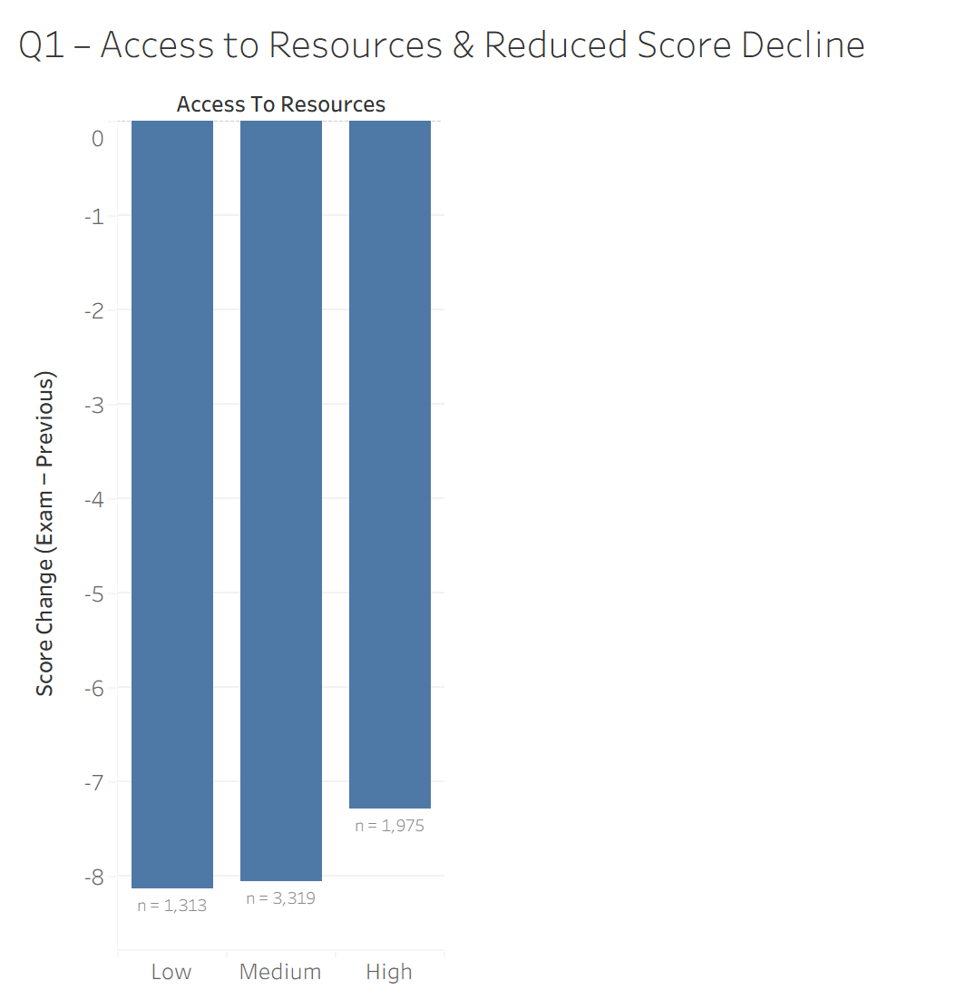
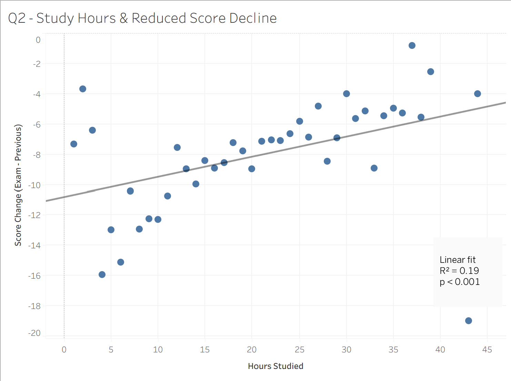
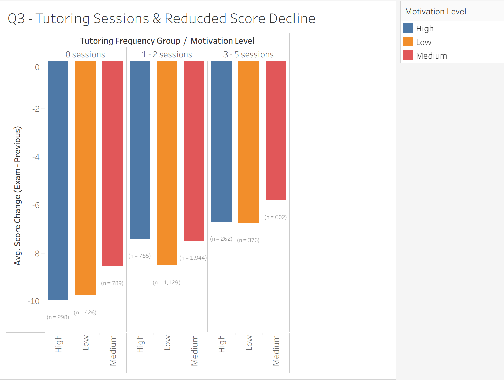

# Student Performance Analysis
## Overview
This project analyzes key factors associated with changes in student academic performance using a Kaggle dataset. The primary objective was to evaluate whether access to resources, hours studied, and tutoring frequency show meaningful associations with score improvement (exam score - previous score).  

## Dataset
* Source: [Kaggle – Student Academic Performance Dataset](https://www.kaggle.com/datasets/ayeshasiddiqa123/student-perfirmance)
* Imported into PostgreSQL via a staging table (student_raw)
* Selected relevant columns for focused analysis:
  * Previous Score
  * Exam Score
  * Hours Studied
  * Tutoring Sessions
  * Access to Resources
  * Motivation Level
  * Attendance

## Data Pipeline
* Created a structured analysis table (student_academic_performance)
* Inserted selected analytical columns from staging table (`student_raw`)
* Created derived metric  
  `score_diff = exam_score - prev_score`  
  This metric captures improvement/decline between exams.
    
## Research Questions
a. Does access to resources affect score improvement?  
b. Is study time correlated with improvement?  
c. Is tutoring frequency associated with reduced score decline?

## Analytical Approach
* Aggregated average `score_diff` across categories
* Included student counts to assess sample stability
* Grouped tutoring sessions to reduce small-sample volatility
* Explored motivation level as a potential confounding variable
* Prioritized effect magnitude and practical relevance over statistical significance alone

## Key Findings 
### Access to Resources
* Minimal differences in score change across resource levels
* Variation between low, medium, and high access is small (≈ <1 point difference)
* Association appears weak relative to tutoring frequency
### Study Hours
* Statistically significant but weak positive relationship with improvement ($R^2$ ≈ 0.19)
* Study time explains a limited portion of variation in score improvement
* One high-study outlier (~42 hours) shows substantial decline, suggesting that extreme study time does not guarantee improvemen
### Tutoring Frequency
* Moderate tutoring (3–5 sessions) shows the strongest association with reduced score decline
* Improvement trend persists across motivation levels
* Higher tutoring categories (6–8 sessions) showed instability due to small sample sizes
* Tutoring emerges as the most actionable intervention variable among those analyzed

## Visualizations
### Q1 – Resources vs Improvement

  

### Q2 – Study Hours vs Improvement

  

### Q3 – Tutoring vs Improvement

  

## Conclusion
While this dataset is observational and does not establish causation, tutoring frequency demonstrates the strongest practical association with improved outcomes. After visually controlling for motivation level, the tutoring pattern remained consistent, suggesting that the relationship is not solely explained by student motivation. This highlights tutoring frequency as a potential intervention lever in academic performance support strategies. 

## Limitations
* Observation dataset (no causal interference)
* Small sample sizes in higher tutoring categories
* Possible unmeasured confounders (parental involvement, etc.)
* Results reflect associations not causal effects

## Tools Used
* PostgreSQL (pgAdmin)
* SQL
* Tableau
* Kaggle Dataset
  
